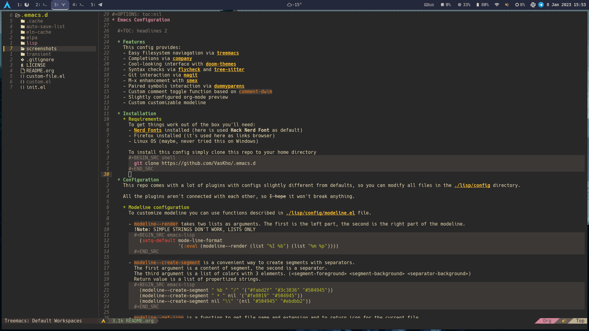

#+OPTIONS: toc:nil
* Emacs Configuration

** Features
This config provides:
- Easy filesystem naviagation via [[https://github.com/Fuco1/dired-hacks/blob/master/dired-subtree.el][dired + dired-subtree]]
- Completions via [[https://github.com/company-mode/company-mode][company]]
- Cool-looking interface with custom theme
- Syntax checks via [[https://github.com/flycheck/flycheck][flycheck]] and [[https://github.com/emacs-tree-sitter/elisp-tree-sitter][tree-sitter]]
- Git interaction via [[https://github.com/magit/magit][magit]]
- M-x enhancement with [[https://github.com/nonsequitur/smex][smex]]
- Paired symbols interaction via [[https://github.com/snosov1/dummyparens][dummyparens]]
- Easy windows navigation via [[https://github.com/abo-abo/ace-window][ace-window]]
- Custom comment toggle function based on ~comment-dwim~
- Slightly configured org-mode preview
- Custom configurable modeline
- LSP for all languages +(that I use at least)+
- Additional config for terminal usage
- Compilation script to build the latest emacs version from GNU releases

** Screenshots

** Installation
*** Requirements
To get things work out of the box you'll need:
- [[https://www.nerdfonts.com/][Nerd Fonts]] installed (here is used *Hack Nerd Font* as default)
- +Firefox+ Librewolf installed (it's used here as links browser)
- Linux OS (maybe, never tried this on Windows)

To install this config simply clone this repo to your home directory
#+BEGIN_SRC shell
  git clone https://github.com/VasKho/.emacs.d
#+END_SRC

** Configuration
This repo comes with a lot of plugins with configs slightly different from defaults, so you can modify all files in the [[./lisp/config]] directory.

All the plugins aren't connected with each other, so +I hope+ it won't break anything.

*** Modeline configuration
To customize modeline you can use functions described in [[./lisp/config/modeline.el]] file.

- ~modeline--render~ takes two lists as arguments.

  The first is the left part, the second is the right part of the modeline.

  *!Note:* SIMPLE STRINGS DON'T WORK, LISTS ONLY
  #+BEGIN_SRC emacs-lisp
    (setq-default mode-line-format
                  '(:eval (modeline--render (list "%I %b") (list "%m %p"))))
  #+END_SRC

- ~modeline--create-segment~ is a convenient way to create segments with separators.

  The first argument is a content of segment, the second is a separator.

  The third argument is a list of colors with 3 elements. (<segment-foreground> <segment-background> <separator-background>)

  Return value is a list of propertized strings.
  #+BEGIN_SRC emacs-lisp
    (modeline--create-segment " %b " "/" '("#fabd2f" "#3c3836" "#504945"))
    (modeline--create-segment " * " nil '("#fe8019" "#504945"))
    (modeline--create-segment nil "\\" '(nil "#504945" "#ebdbb2"))
  #+END_SRC

- ~modeline--get-icon~ is a function to get file name and extension and to return icon for the current file.

  To get more info about creating more entries you can simply read the [[file:./lisp/config/modeline.el::24][source]].

** Keybindings

There are a lot of them and almost all are default.

|-------------+----------------------------------------------|
| Bind        | Action                                       |
|-------------+----------------------------------------------|
| ~M-;~       | Comment toggle                               |
|-------------+----------------------------------------------|
| ~C-x g~     | Start magit buffer                           |
|-------------+----------------------------------------------|
| ~M-0~       | Open dired in another window (with focus)    |
|-------------+----------------------------------------------|
| ~C-M-0~     | Open dired in another window (without focus) |
|-------------+----------------------------------------------|
| ~M-o~       | Enable ace-window                            |
|-------------+----------------------------------------------|
| ~M-s M-r~   | Start recursive search                       |
|-------------+----------------------------------------------|
| ~C-c C-w s~ | Open workspace selection interface           |
|-------------+----------------------------------------------|

+ + All default emacs and plugins keybindings.
